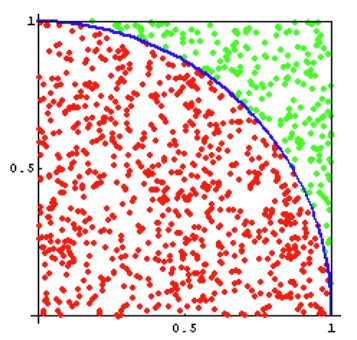
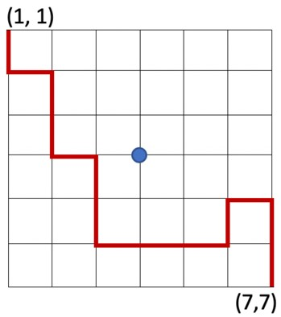
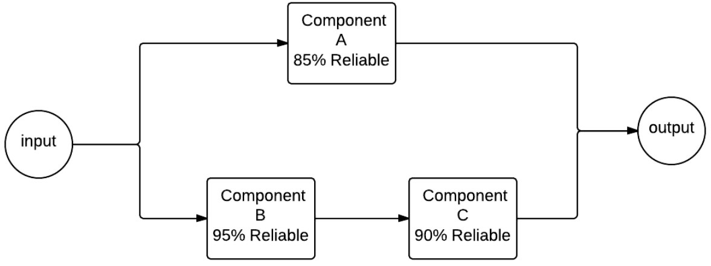
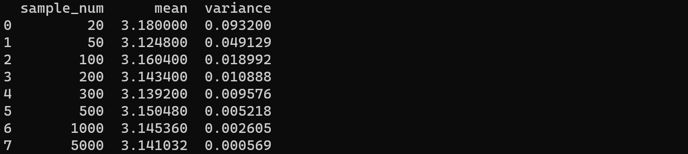
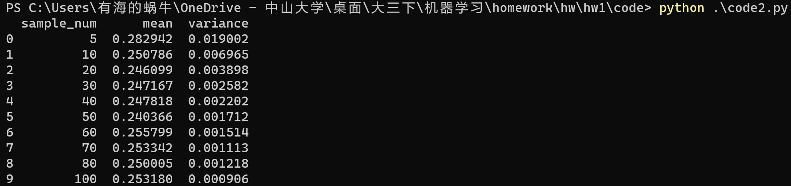
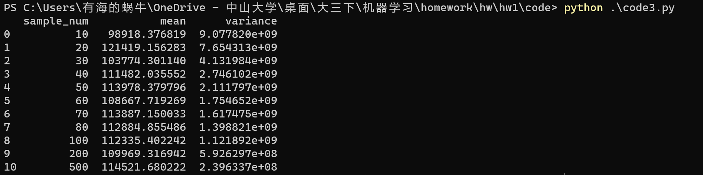
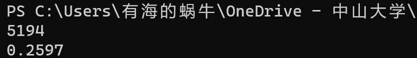
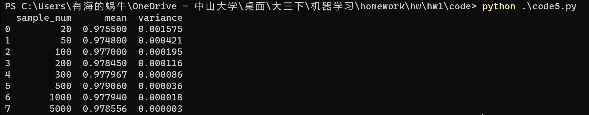

# <center>（2021 学年春季学期）HW1

## <center>课程名称：机器学习与数据挖掘 任课教师：梁上松

| 年级+班级 | 19级计科           | 专业（方向） | 计算机科学与技术 |
| --------- | ------------------ | ------------ | ---------------- |
| 学号      | 193350**           | 姓名         | ***              |
| Email     | \*\*\*\*\*\*\*\*\* | 完成日期     | 2022年3月20日    |

## 目录

[TOC]

### Ⅰ 作业内容

#### **Exercise 1.**

> The Monte Carlo method can be used to generate an approximate value of pi. The figure below shows a unit square with a quarter of a circle inscribed. The area of the square is 1 and the area of the quarter circle is pi/4. Write a script to generate random points that are distributed uniformly in the unit square. The ratio between the number of points that fall inside the circle (red points) and the total number of points thrown (red and green points) gives an approximation to the value of pi/4. This process is a Monte Carlo simulation approximating pi. Let N be the total number of points thrown. When N=50, 100, 200, 300, 500, 1000, 5000, what are the estimated pi values, respectively? For each N, repeat the throwing process 100 times, and report the mean and variance. Record the means and the corresponding variances in a table. 
>
> 

#### **Exercise 2.** 

> We are now trying to integrate the another function by Monte Carlo method:
>
> ​																*$\int_{0}^{1}x^3$*
>
> A simple analytic solution exists here: $\int_{x =0}^{1}x^3=1/4$. If you compute this integration using Monte Carlo method, what distribution do you use to sample x? How good do you get when N = 5, 10, 20, 30, 40, 50, 60, 70, 80, 100, respectively? For each N, repeat the Monte Carlo process 100 times, and report the mean and variance of the integrate in a table.

#### **Exercise 3.**

> We are now trying to integrate a more difficult function by Monte Carlo method that may not be analytically computed:
>
> ​																$\int_{x=2}^{4}\int_{y=-1}^1f(x,y)=\frac{y^2*e^{-y^2}+x^4*e^{-x^2}}{x*e^{-x^2}}$
>
> Can you compute the above integration analytically? If you compute this integration using Monte Carlo method, what distribution do you use to sample (x,y)? How good do you get when the sample sizes are N = 5, 10, 20, 30, 40, 50, 60, 70, 80, 100, 200 respectively? For each N, repeat the Monte Carlo process 100 times, and report the mean and variance of the integrate.

#### **Exercise 4.**

> An ant is trying to get from point A to point B in a grid. The coordinates of point A is (1,1) (this is top left corner), and the coordinates of point B is (n,n) (this is bottom right corner, n is the size of the grid).
>
> Once the ant starts moving, there are four options, it can go left, right, up or down (no diagonal movement allowed). If any of these four options satisfy the following:
>
> (a) The new point should still be within the boundaries of the n×n grid
>
> (b) Only the center point (4, 4) is allowed to be visited zero, one or two times, while the remainder points should not be visited previously (are allowed to be visited zero or one time).
>
> If P is the probability of the ant reaching point B for a 7×7 grid, use Monte Carlo simulation to compute P. Pick the answer closest to P in value (assume 20,000 simulations are sufficient enough to compute P).
>
> 

#### **Exercise 5.**

> Given a system made of discrete components with known reliability, what is the reliability of the overall system? For example, suppose we have a system that can be described with the following high-level diagram:
>
> 
>
> When given an input to the system, that input flows through component A or through components B and C, each of which has a certain reliability of correctness. Probability theory tells us the following:
>
> $reliability_{BC}=0.95*0.90=0.855$
>
> $reliability_A=0.85$
>
> And the overall reliability of the system is:
>
>  $reability_{sys}=1.0-[1.0-0.85*(1.0-0.855)]=0.97825$
>
> Create a simulation of this system where half the time the input travels through component A. To simulate its reliability, generate a number between 0 and 1. If the number is 0.85 or below, component A succeeded, and the system works. The other half of the time, the input would travel on the lower half of the diagram. To simulate this, you will generate two numbers between 0 and 1. If the number for component B is less than 0.95 and the number for component C is less than 0.90, then the system also succeeds. Run many trials to see if you converge on the same reliability as predicted by probability theory.

### Ⅱ 问题解答

#### answer 1：

- 结果如下图所示：

  
  
- 关键代码解释：

  我们迭代每种采样次数：

  ```python
  sample_numList = [20,50,100,200,300,500,1000,5000]
  for sample_num in sample_numList:
  ```

  对每种采样次数，我们都重复进行100，并记录这100次的均值和方差。

  其中，对每种采样次数的每一次采样我们都需要其是否落在圆当中：

  ```python
  def is_in(coordinate):
      distance = coordinate[0] ** 2 + coordinate[1] ** 2
      distance = distance ** 0.5
      if distance < 1:
          return True
      else:
          return False
  ```

#### answer 2：

**本题解答采用蒙特卡洛方法的平均值法求解**

+ 首先我认为任意只在函数$f(x)=x^3$的积分区域有概率分布的分布函数都是满足的，都可以用作采样的方法。但考虑到积分区域有界并且为了实验的简单起见，采用**均匀分布**实现。

+ 以下是结果：

  

+ 关键代码解释：

  ```python
  for i in range(100):
      samples = np.random.uniform(0,1,[1,sample_num])
  
      for sample in samples[0]:
          result[i] += func(sample)
  
      result[i] *= (area/sample_num)
  ```

  其中我们生成了`sample_num`个在0到1之间均匀分布的点，然后计算它们的函数值并求和，最后为他们的值乘上积分区间的值再除以总的采样次数

#### answer 3：

+ 太复杂，无法通过公式求解，蒙特卡洛法求解过程与上题一致

+ 本题依旧选择采用均匀分布实现

+ 结果如下图：

  

#### answer 4：

+ 结果如下图所示：

  

  根据多次实验结果来看，概率P应该在0.25左右
  
+ 关键代码解释：

  实现过程大概类似于dfs，但是每次只随机选择一条可行方向（无越界，访问次数符合要求），其它方向不再遍历。如此重复进行20000次。

  ```python
  def dfs(grid,r,c):
      grid[r][c] += 1
      if r == len(grid) - 1 and c == len(grid[0]) - 1:
          return True
      dire = [-1,0,1,0,-1]
      dir_list = []
  
      for i in range(4):
          x,y = r + dire[i],c + dire[i+1]
          if x < 0 or x >= len(grid) or y < 0 or y >= len(grid[0]):
              continue
          if x == 3 and y == 3:
              if grid[x][y] == 2:
                  continue
          else :
              if grid[x][y] == 1:
                  continue
          dir_list.append([x,y])
  
      if len(dir_list) == 0:
          return False
      ra = random.randint(0,len(dir_list) - 1)
      return dfs(grid,dir_list[ra][0],dir_list[ra][1])
  ```

  我们递归查询路径，先将到达点的访问次数赠一，如果到达终点就返回。其后通过`dire`以及之后的for循环将可行的下一点的坐标放入`dir_list`。最后我们随机选择`dir_list`中的一点作为下一个目标点，然后递归查询路径。

#### answer 5：

+ 实现过程：

  + 我们重复进行多次模拟，只有路径A和路径BC同时不满足时，我们才认为此次模拟结果失败，最后将总的成功的模拟次数除以总模拟次数，得到最终的模拟概率。
  + 每次实验中，我们随机进行N次，N取20,50,100,200,300,500,1000,5000，然后每次重复100次，最后计算均值和方差。

+ 实验结果：

  

  可见采样越多，效果较好，方差越小

+ 核心代码：

  ```python
  samples = np.random.rand(sample_num,3)
  
  for sample in samples:
      p_A = sample[0]
      p_B = sample[1]
      p_C = sample[2]
  
      if p_A <= 0.85:
          result[i] += 1
      elif p_B <= 0.95 and p_C <= 0.90:
          result[i] += 1
  ```

  