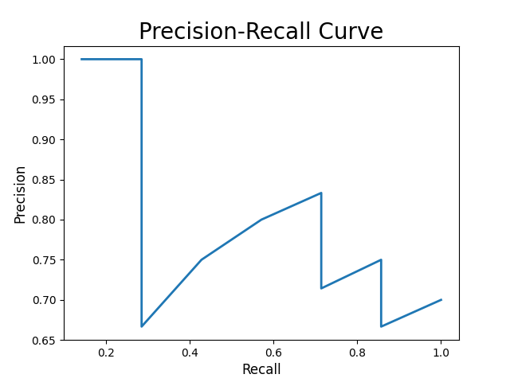

# Homework 2: Evaluation Metrics

| Student ID | Student Name |
| :--------: | :----------: |
|  193350**  |     ***      |

> Lectured by: Shangsong Liang

> Information Retrieval Course
> Sun Yat-sen University

- [Homework 2: Evaluation Metrics](#homework-2-evaluation-metrics)
  - [Exercise 1: Rank-based Evaluation Metrics, MAP@K, MRR@K](#exercise-1-rank-based-evaluation-metrics-mapk-mrrk)
    - [(a) AP@5 AP@10 RR@5 RR@10](#a-ap5-ap10-rr5-rr10)
    - [(b) MAP@5 MAP@10 MRR@5 MRR@10](#b-map5-map10-mrr5-mrr10)
  - [Exercise 2: Rank-based Evaluation Metrics, Precision@K, Recall@K, NDCG@K](#exercise-2-rank-based-evaluation-metrics-precisionk-recallk-ndcgk)
    - [(a) P@5 P@10](#a-p5-p10)
    - [(b) R@5 R@10](#b-r5-r10)
    - [(c) maximize P@5](#c-maximize-p5)
    - [(d) maximize P@10](#d-maximize-p10)
    - [(e) maximize R@5](#e-maximize-r5)
    - [(f) maximize R@10](#f-maximize-r10)
    - [(g) R-Precision](#g-r-precision)
    - [(h) AP; difference between AP and MAP](#h-ap-difference-between-ap-and-map)
    - [(i) maximize AP](#i-maximize-ap)
    - [(j) $DCG_5$](#j-dcg_5)
    - [(k) $NDCG_5$](#k-ndcg_5)
  - [Exercise 3: Precision-Recall Curves](#exercise-3-precision-recall-curves)
  - [Exercise 4: Other Evaluation Metrics](#exercise-4-other-evaluation-metrics)
    - [AUC（Area under ROC curve）](#aucarea-under-roc-curve)
    - [Kendall tau distance](#kendall-tau-distance)
    - [Spearman’s ρ](#spearmans-ρ)

## Exercise 1: Rank-based Evaluation Metrics, MAP@K, MRR@K

### (a) AP@5 AP@10 RR@5 RR@10

| query |  AP@5  | AP@10  |  RR@5  | RR@10  |
| :---: | :----: | :----: | :----: | :----: |
|   1   | 0.806  | 0.7329 |   1    |   1    |
|   2   |  0.5   | 0.375  |  0.5   |  0.5   |
|   3   | 0.3333 | 0.3063 | 0.3333 | 0.3333 |

### (b) MAP@5 MAP@10 MRR@5 MRR@10

| MAP@5  | MAP@10 | MRR@5 | MRR@10 |
| :----: | :----: | :---: | :----: |
| 0.5464 | 0.4714 | 0.611 | 0.611  |

## Exercise 2: Rank-based Evaluation Metrics, Precision@K, Recall@K, NDCG@K

### (a) P@5 P@10

​			0.8000,0.7000

### (b) R@5 R@10

​			这里假设数据库总量就是上述结果

​			可得4/7，1

### (c) maximize P@5

| rank | docID | binary relevance |
| :--: | :---: | :--------------: |
|  1   |  51   |        1         |
|  2   |  501  |        1         |
|  3   |  75   |        1         |
|  4   |  321  |        1         |
|  5   |  38   |        1         |

### (d) maximize P@10

题目给出的文档只有10个，因此任意排序的P@10相等，均满足条件。如果多于10个文档，排序在10之后的文档有相关文档的话，P@10就不相等，此时求最大值才有意义。例如以下：

| rank | docID | binary relevance |
| :--: | :---: | :--------------: |
|  1   |  51   |        1         |
|  2   |  501  |        1         |
|  3   |  75   |        1         |
|  4   |  321  |        1         |
|  5   |  38   |        1         |
|  6   |  412  |        1         |
|  7   |  101  |        1         |
|  8   |  21   |        0         |
|  9   |  521  |        0         |
|  10  |  331  |        0         |

### (e) maximize R@5

| rank  | docID | binary relevance |
| :---: | :---: | :--------------: |
|   1   |  51   |        1         |
|   2   |  501  |        1         |
|   4   |  75   |        1         |
|   5   |  321  |        1         |
|   6   |  38   |        1         |

$$
此时R@5 = 0.71
$$

### (f) maximize R@10

和 (d) 中一样的排序

### (g) R-Precision

R-Precision 是序列前 R 个位置的准确率；为了保证用户的体验，我们需要尽量让 R-Precision 率大

### (h) AP; difference between AP and MAP

$$
AP = \frac{(1 + \frac{2}{2} + \frac{3}{4} + \frac{4}{5} + \frac{5}{7} + \frac{6}{8} + \frac{7}{9})}{7} = 0.8333
$$

AP 是针对一个查询的平均， MAP 则是针对多个查询的 AP 取平均值

### (i) maximize AP

| rank | docID | binary relevance |
| :--: | :---: | :--------------: |
|  1   |  51   |        1         |
|  2   |  501  |        1         |
|  3   |  75   |        1         |
|  4   |  321  |        1         |
|  5   |  38   |        1         |
|  6   |  412  |        1         |
|  7   |  101  |        1         |
|  8   |  21   |        0         |
|  9   |  521  |        0         |
|  10  |  331  |        0         |

### (j) $DCG_5$

> $DCG_p$ 公式采用的是 $\sum_{i = 1}^{p} \frac{rel_i}{\log_2(i + 1)}$

$$
DCG_5 = \sum_{i = 1}^{5} \ \frac{rel_i}{\log_2(i + 1)} = 4 + 0.6309 + 0 + 1.2920 + 1.5474 = 7.4703
$$

### (k) $NDCG_5$

$$
NDCG_5 = \frac{DCG_5}{IDCG_5} = \frac{4 + 0.6309 + 0 + 1.2920 + 1.5474}{4 + 2.523 + 1.5 + 0.8614 + 0.3868} = 0.8056
$$

## Exercise 3: Precision-Recall Curves

## Exercise 4: Other Evaluation Metrics

### Kendall tau distance

比较两个排序之间，评价存在分歧的对的数量。

$$
  K(\tau_1, \tau_2) = | \{(i, j) : i < j, \ (\tau_1(i) < \tau_1(j) \wedge \tau_2(i) > \tau_2(j)) \ \vee \ (\tau_1(i) > \tau_1(j) \wedge \tau_2(i) < \tau_2(j)) \} |
$$

其中 $\tau_1(i)$ 和 $\tau_2(i)$ 分别表示元素 $i$ 在两个排序中的位置

如果两个排序完全一样，那么 Kendall tau distance 为0；如果完全相反，那么为 $n(n - 1) / 2$ ；通常该距离都会除以 $n(n - 1) / 2$ 来进行归一化

### Spearman’s ρ

比较两个排序的（排序值的）皮尔逊相关系数

$$
\frac{\sum_{(i, j) \in \Omega^{test}} (S^*_{ij} - \bar{s}^*) (y^*_{ij} - \bar{y}^*)}{\sqrt{\sum_{(i, j) \in \Omega^{test}} (S^*_{ij} - \bar{s}^*)^2 \ \sqrt{\sum_{(i, j) \in \Omega^{test}} (y^*_{ij} - \bar{y}^*)}}}
$$

其中 $s^*_{ij}$ 表示你模型预测中，物品 $j$ 在用户 $i$ 的推荐列表上的排序位置；$y^*_{ij}$ 表示按实际用户 $i$ 对物品的评分来排序时物品 $j$ 在 $i$ 的推荐列表上的排序位置；$\bar{s}^*$ 是 $s^*_{ij}$ 的平均值；$\bar{y}^*$ 是 $y^*_{ij}$ 的平均值

### AUC（Area under ROC curve）

AUC的物理意义为任取一对例和负例，正例得分大于负例得分的几率，AUC越大，代表方法效果越好。（AUC的值通常介于0.5~1）