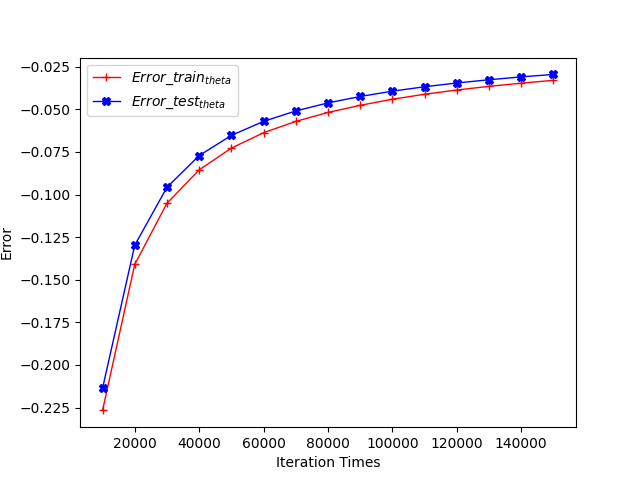

# 
（2021 学年春季学期）HW3

## 
课程名称：机器学习与数据挖掘 任课教师：梁上松

| 年级+班级 | 19级计科 | 专业（方向） | 计算机科学与技术（超级计算方向） |
| --------- | -------- | ------------ | -------------------------------- |
| 学号      | 193350** | 姓名         | ***                              |
| Email     | snailkk  | 完成日期     | 2022年3月28日                    |

>重要提醒：本次作业主要参考了周志华的机器学习一书，公式模型的得出和推导均来自于此，代码是完完全全按照书上实现，只有在第二题对目标函数加了负号，将问题从最小化目标函数变为了最大化目标函数。

## Exercise One: Linear Regression

### (a) 梯度下降法训练线性回归模型

> 迭代次数 1500000
> 学习率 0.00015
> 其他参数 0.0

+ 首先构建以下线性回归模型：
  $$
  h(x) = \theta_0 + \theta_1 x_1 + \theta_3 x_2
  $$

  其中$\theta_0$为偏置项（bias）。因此我们可知道我们的模型一共需要三个参数，分别为：$\theta_0,\theta_1,\theta_2$。

+ 然后构建误差函数：

$$
E_{\theta} = \frac{1}{2m} \sum (h_{\theta} (x^{(i)}) - y^{(i)})^2
$$

+ 误差项对每个参数求偏导，再依据梯度下降思想，可得单次迭代公式为：
  $$
  \begin{aligned}
    \theta_0 = & \theta_0 - \alpha \frac{1}{m} \sum_{i = 1}^m (h_{\theta} (x^{(i)}) - y^{(i)}) \cdot x_0^{(i)} \\
    \theta_1 = & \theta_1 - \alpha  \frac{1}{m} \sum_{i = 1}^m (h_{\theta} (x^{(i)}) - y^{(i)}) \cdot x_1^{(i)}\\
    \theta_2 = & \theta_2 - \alpha \frac{1}{m} \sum_{i = 1}^m (h_{\theta} (x^{(i)}) - y^{(i)}) \cdot x_2^{(i)}\\
  \end{aligned}
  $$

  其中比较重要的是：$\alpha $为学习率，参数$x_0^{(i)}$恒为1。

  更一般的，参数更新可以写成：
  $$
  \theta = \theta - \alpha \frac{1}{m} \sum_{i = 1}^m (h_{\theta} (x^{(i)}) - y^{(i)}) \cdot x^{(i)}
  $$
  
+ 最后结果如下图所示：

  

### (b) 学习率 0.0002 进行训练

> 迭代次数 1500
> 学习率 0.0002
> 其他参数 0.0

> 由于学习率增大，导致 numpy 中的 float64 无法储存数据，出现越界情况，因此需要降低迭代次数

发现结果会在最后一轮迭代时误差变得极大，结果难以正确收敛，因此需要适当降低学习率，从而加快模型收敛

### (c) 随机梯度下降迭代

> 迭代次数 1500000
> 学习率 0.00015
> 其他参数 0.0

对于每次迭代，用随机选择 $k$ 个数据取代原本的使用全部数据，从而降低训练时间

每次迭代随机选择**1**个点：

每次迭代随机选择**5**个点：

由于随机性的存在，即使随着迭代次数的增加导致测试误差整体下降，但是波动依然很大，但是训练时间较短

## Exercise Two: Logistic Regression

### (a) 条件对数似然公式。

使用 Sigmoid 函数作为逻辑函数

$$
  g(z) = \frac{1}{1 + e^{-z}}
$$

令
$$
\beta = \begin{bmatrix}
    w_0 & w_1 & w_2 & ... & w_p
  \end{bmatrix},\hat{x} = (1;x)
  \\p_1(\hat{x};\beta) = p(y = 1|\hat{x};\beta)
  \\p_0(\hat{x};\beta) = p(y = 0|\hat{x};\beta)=1-p_1(\hat{x};\beta)
$$
因为有：
$$
p(y = 1|\hat{x}) = \frac{e^z}{1+e^z}
\\p(y = 0|\hat{x}) = \frac{1}{1+e^z}
\\z = \beta^{T}\hat{x}
$$
则可得以下条件似然项:
$$
\begin{aligned}
  & p(y_i|x_i;\beta) = y_ip_1(\hat{x_i};\beta) + (1-y_i)p_0(\hat{x_i};\beta)
\end{aligned}
$$

最终，我们可以写出如下条件对数似然公式：

$$
f(\beta)=\frac{1}{m}\sum_{i = 1}^mln(p(y_i|x_i;\beta))=-\frac{1}{m}\sum_{i = 1}^m(-y_i\beta^T\hat{x_i}+ln(1+e^{\beta^T\hat{x_i}}))
$$

**后续需要最大化对数似然**

### (b) 推导出∂f/∂w0和∂f/∂wj，并说明所有的导数都可以写成有限和形式。

由于参数$\beta$是一个向量：

$$
\beta = \begin{bmatrix}
    w_0 & w_1 & w_2 & ... & w_p
  \end{bmatrix}
$$

则我们可以将所有导数写成以下有限和的形式：

$$
\frac{\partial f(\beta)}{\partial\beta}=\frac{1}{m}\sum_{i=1}^{m}\hat{x_i}(y_i-p_1(\hat{x_i};\beta))
$$

### (c) 训练逻辑回归分类器并测试。逻辑回归分类器中最优的估计参数是什么?

> 学习率 0.00015
> 初始参数 $\beta = \begin{bmatrix} w_0 & w_1 & w_2 & w_3 & w_4 & w_5 & w_6 \end{bmatrix} = \begin{bmatrix} 0 & 0 & 0 & 0 & 0 & 0 & 0 \end{bmatrix}$

在不使用随机抽样的梯度下降的情况下，发现在迭代次数较小的时候便会收敛，并且在测试集上的效果也好

得到的最优的参数估计为：

使用随机抽样进行随机梯度下降后，每次迭代选择一个点，效果如下：

得到的最优的参数估计为：

每次迭代选择10个点，效果如下：

得到的最优的参数估计为：

可以发现即使使用了随机抽样，但是都能在较小迭代次数时使得错误率收敛

### (d)测试数据集中错误分类示例的数量。

当迭代次数足够多时，错误率会降低到0

### (e)绘制随机梯度上升每次迭代的目标函数值，横轴为迭代次数，纵轴为目标值。报告算法收敛所需的迭代次数。

> 学习率为 0.00015
> 迭代次数 150000，每10000次进行一次对比
> 每次随机抽样一个点
> 初始参数 $\beta = \begin{bmatrix} w_0 & w_1 & w_2 & w_3 & w_4 & w_5 & w_6 \end{bmatrix} = \begin{bmatrix} 0 & 0 & 0 & 0 & 0 & 0 & 0 \end{bmatrix}$

效果如图：

发现目标函数虽然在收敛，但是收敛速率较慢，因此决定调整参数

> 学习率为 0.002
> 迭代次数 150000，每10000次进行一次对比
> 每次随机抽样10个点
> 初始参数 $\beta = \begin{bmatrix} w_0 & w_1 & w_2 & w_3 & w_4 & w_5 & w_6 \end{bmatrix} = \begin{bmatrix} 0 & 0 & 0 & 0 & 0 & 0 & 0 \end{bmatrix}$

可以看到，在至少90000次后，测试平均对数似然低于 -0.05

> 学习率为 0.1
> 迭代次数 100，每10次进行一次对比
> 分别使用全部数据和随机一个数据进行训练
> 初始参数 $\beta = \begin{bmatrix} w_0 & w_1 & w_2 & w_3 & w_4 & w_5 & w_6 \end{bmatrix} = \begin{bmatrix} 0 & 0 & 0 & 0 & 0 & 0 & 0 \end{bmatrix}$

效果如下：

TargetFunc1是每次训练只随机选取一个数据，可见选取全部数据收敛的稳定性较好，收敛速度也较快。但是运行速度随机选取一个数据速度更快。

### (f) 接下来，您将评估训练和测试错误如何随着训练集大小的增加而变化。对于集合{10,20,30，…， 380, 390, 400}中k的每一个值，首先选择大小为k的训练数据的随机子集，然后使用你刚刚选择的训练数据的k个随机子集重新训练你的逻辑回归分类器，并利用估计的参数计算当前训练集(k个随机实例)和原始测集“datafortestinglogistics .txt”上的误分类样本数。最后，用两条线生成一个图:蓝色表示训练误差相对于k的值，红色表示测试误差相对于k的值，垂直轴和训练集上的误差应该在哪里,尺寸应在横轴上。确保在你的情节中包含一个图例来标记这两条线。描述随着训练集大小的增加，训练和测试错误发生了什么，并解释为什么会发生这种行为。

> 学习率 0.00015
> 每个测试集迭代次数150次，迭代完成后进行对比
> 初始参数 $\theta = \begin{bmatrix} w_0 & w_1 & w_2 & w_3 & w_4 & w_5 & w_6 \end{bmatrix} = \begin{bmatrix} 0 & 0 & 0 & 0 & 0 & 0 & 0 \end{bmatrix}$

这题选择不做，自己去做吧。代码没什么问题，自己改改就好了。